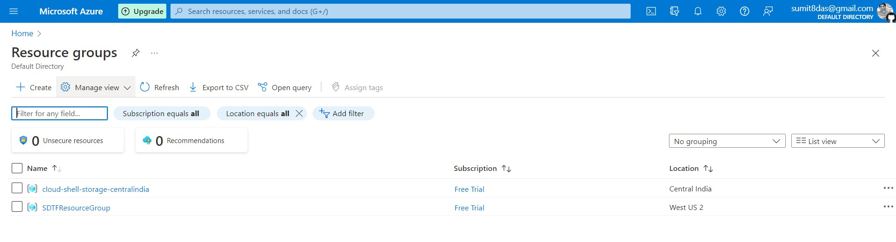

# learn-terraform-azure

[Reference Tutorial Link](https://developer.hashicorp.com/terraform/tutorials/azure-get-started/azure-build)
Commands:

```
az login
az account set --subscription "35akss-subscription-id"
az ad sp create-for-rbac --role="Contributor" --scopes="/subscriptions/<SUBSCRIPTION_ID>"

$ $Env:ARM_CLIENT_ID = "<APPID_VALUE>"
$ $Env:ARM_CLIENT_SECRET = "<PASSWORD_VALUE>"
$ $Env:ARM_SUBSCRIPTION_ID = "<SUBSCRIPTION_ID>"
$ $Env:ARM_TENANT_ID = "<TENANT_VALUE>"

terraform fmt
terraform validate
terraform plan
terraform apply
terraform show
terraform state list
```


```


```